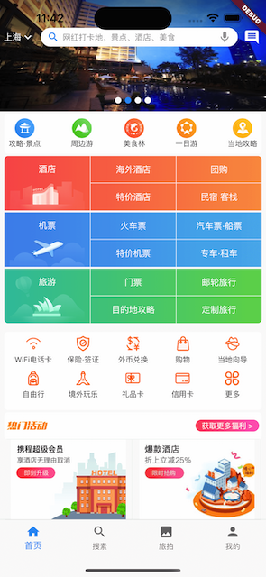
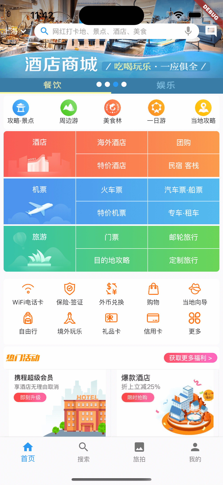
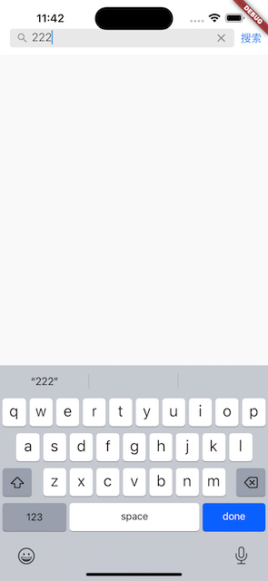
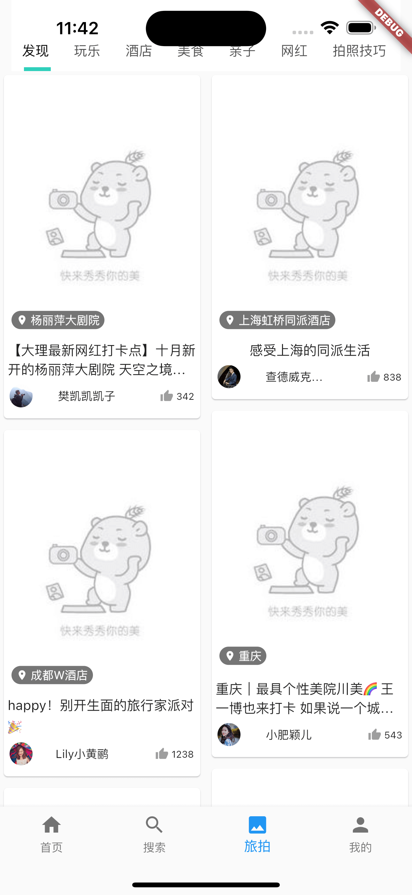
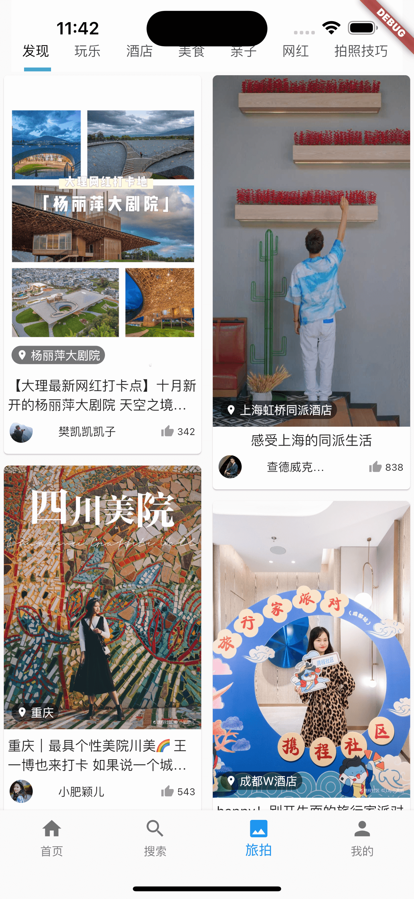

# travel
高仿携程app 
主要技术点：
1、轮播图
2、json转模型
3、自定义navigationbar
4、Dio网络请求
5、路由导航
6、图片缓存
7、图片渐变
8、rich富文本
9、Tabbar/TabbarView
10、pageController/PageView
11、widgetPage浏览缓存
12、 webView浏览器
13、下拉加载更多
14、上拉获取更多

